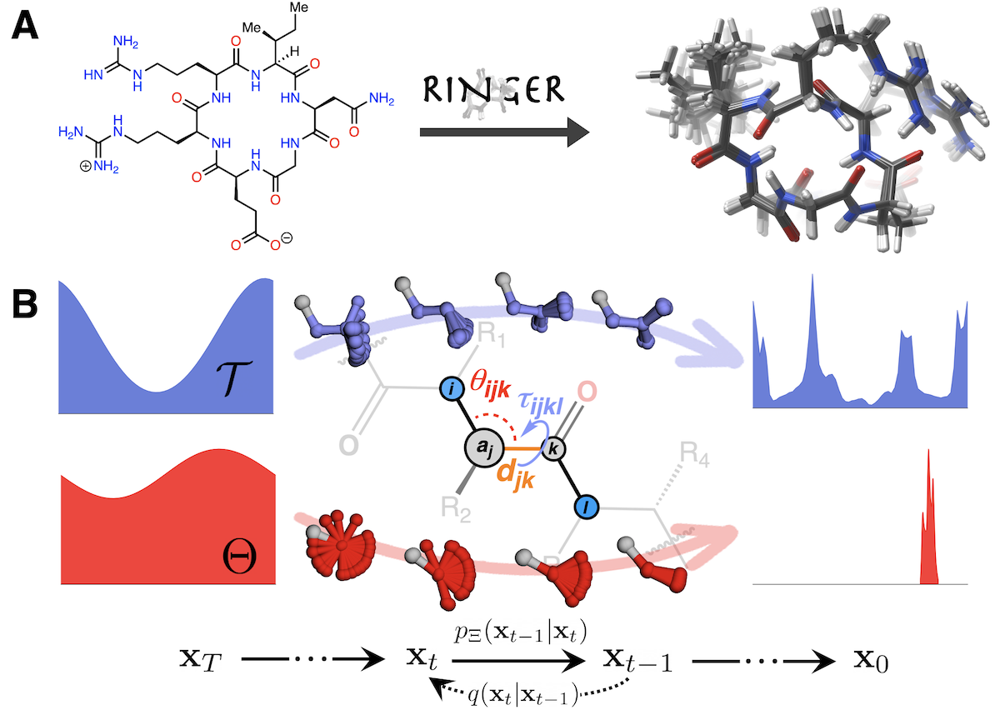

# RINGER

This repository is the official implementation of [RINGER: Rapid Conformer Generation for Macrocycles with Sequence-Conditioned Internal Coordinate Diffusion](https://arxiv.org/abs/2305.19800).



## Requirements

To install requirements:

```setup
conda env create -f environment.yaml
conda activate ringer
pip install -e .
```

## Data

Download and extract the CREMP pickle.tar.gz from [here](https://doi.org/10.5281/zenodo.7931445). Use [train.csv](data/cremp/train.csv) and [test.csv](data/cremp/test.csv) to partition it into training and test data and put the corresponding files into [train](data/cremp/train) and [test](data/cremp/test).

## Training

To train the full conditional model, run this command:

```train
train conditional.json
```

The config file can be specified by an absolute path or by a path relative to the [configs](configs) folder. Similarly, within the config file, `data_dir` can be an absolute path or a path relative to the [data](data) folder.

To log a training run with Weights & Biases, set up your configuration in [configs/wandb/wandb.json](configs/wandb/wandb.json) and set up logging using:

```train
train conditional.json --wandb-run <run_name>
```

## Evaluation

The [pre-trained model](assets/models/conditional) is included in this repository.

To generate samples and evaluate the pre-trained model on all the test data, run:

```eval
evaluate \
    --model-dir <path_to_ringer>/assets/models/conditional \
    --data-dir cremp/test \
    --split-sizes 0.0 0.0 1.0
```

Run `evaluate --help` to see all options available for sampling and evaluation.

## Contributing

Install pre-commit hooks to use automated code formatting before committing changes. Make sure you're in the top-level directory and run:

```bash
pre-commit install
```

After that, your code will be automatically reformatted on every new commit.

To manually reformat all files in the project, use:

```bash
pre-commit run -a
```

To update the hooks defined in [.pre-commit-config.yaml](.pre-commit-config.yaml), use:

```bash
pre-commit autoupdate
```

## License

Licensed under the MIT License. See [LICENSE](LICENSE) for additional details.

## Citations

For the code and/or model, please cite:

```
@misc{grambow2023ringer,
    title={{RINGER}: Rapid Conformer Generation for Macrocycles with Sequence-Conditioned Internal Coordinate Diffusion}, 
    author={Colin A. Grambow and Hayley Weir and Nathaniel L. Diamant and Alex M. Tseng and Tommaso Biancalani and Gabriele Scalia and Kangway V. Chuang},
    year={2023},
    eprint={2305.19800},
    archivePrefix={arXiv},
    primaryClass={q-bio.BM}
}
```

To cite the CREMP dataset, please use:

```
@misc{grambow2023cremp,
    title={{CREMP}: Conformer-Rotamer Ensembles of Macrocyclic Peptides for Machine Learning}, 
    author={Colin A. Grambow and Hayley Weir and Christian N. Cunningham and Tommaso Biancalani and Kangway V. Chuang},
    year={2023},
    eprint={2305.08057},
    archivePrefix={arXiv},
    primaryClass={q-bio.BM}
}
```

You can also cite the CREMP Zenodo repository directly:

```
@dataset{grambow_colin_a_2023_7931445,
  author       = {Grambow, Colin A. and
                  Weir, Hayley and
                  Cunningham, Christian N. and
                  Biancalani, Tommaso and
                  Chuang, Kangway V.},
  title        = {{CREMP: Conformer-Rotamer Ensembles of Macrocyclic 
                   Peptides for Machine Learning}},
  month        = may,
  year         = 2023,
  publisher    = {Zenodo},
  version      = {1.0.0},
  doi          = {10.5281/zenodo.7931445},
  url          = {https://doi.org/10.5281/zenodo.7931445}
}
```
